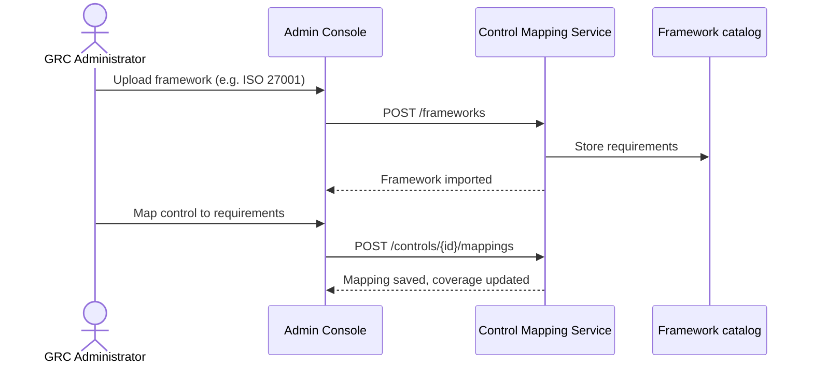

# Framework import and control mapping

```mermaid
sequenceDiagram
    actor Admin as GRC Administrator
    participant UI as Admin Console
    participant Map as Control Mapping Service
    participant Cat as Framework catalog

    Admin->>UI: Upload framework (e.g. ISO 27001)
    UI->>Map: POST /frameworks
    Map->>Cat: Store requirements
    Map-->>UI: Framework imported
    Admin->>UI: Map control to requirements
    UI->>Map: POST /controls/{id}/mappings
    Map-->>UI: Mapping saved, coverage updated
```
