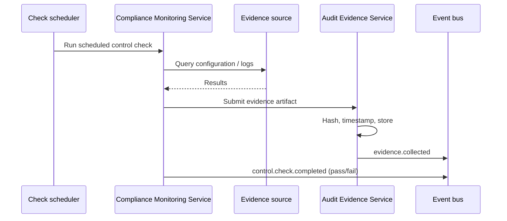

# Automated evidence collection

```mermaid
sequenceDiagram
    participant Sch as Check scheduler
    participant Mon as Compliance Monitoring Service
    participant Src as Evidence source
    participant Ev as Audit Evidence Service
    participant Bus as Event bus

    Sch->>Mon: Run scheduled control check
    Mon->>Src: Query configuration / logs
    Src-->>Mon: Results
    Mon->>Ev: Submit evidence artifact
    Ev->>Ev: Hash, timestamp, store
    Ev->>Bus: evidence.collected
    Mon->>Bus: control.check.completed (pass/fail)
```
