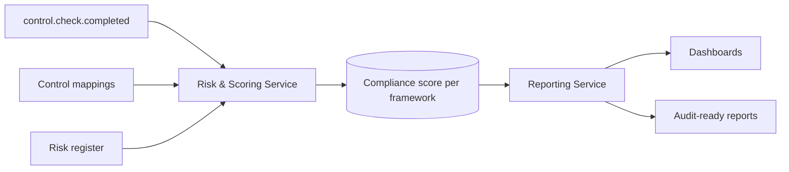

# Compliance scoring and reporting

```mermaid
flowchart LR
    checks[control.check.completed] --> scoring[Risk & Scoring Service]
    mappings[Control mappings] --> scoring
    risks[Risk register] --> scoring
    scoring --> score[(Compliance score per framework)]
    score --> report[Reporting Service]
    report --> dash[Dashboards]
    report --> pdf[Audit-ready reports]
```
